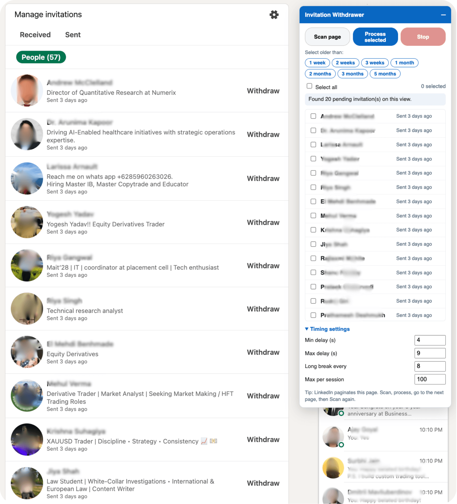
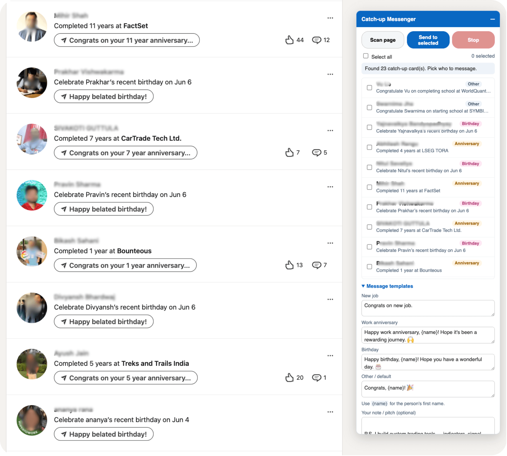

<h1 align="center">LinkedIn Network Helper</h1>

  <b>A free Chrome extension to bulk-withdraw sent LinkedIn invitations and send catch-up congrats messages — with human-like timing.</b>

  
  
  
  
  

---

## ✨ What it does

**LinkedIn Network Helper** is a free, open-source [Manifest V3](https://developer.chrome.com/docs/extensions/mv3/intro/) Chrome extension that automates two of the most tedious LinkedIn networking chores — **without looking like a bot**. It runs entirely in your own browser, on pages you're already logged into. **Nothing is ever sent to any server.**

It bundles **two tools**:

| Tool | What it does |
|---|---|
| 🧹 **Invitation Withdrawer** | Scan your *sent* invitations, filter by age (1 week → 5 months), and **bulk-withdraw** the ones you select. |
| 🎉 **Catch-up Messenger** | Scan your *Catch-up* page and send **personalized congrats messages** (new job / work anniversary / birthday) using per-event templates. |

Both tools mimic real human behavior — randomized delays, realistic pointer clicks, longer rest breaks, and per-session caps — to **reduce the chance LinkedIn flags your account as automated.**

---

## 📸 Screenshots & demo

> _Add your PNGs to the `screenshots/` folder to make these render._

### Invitation Withdrawer

Scan the Sent-invitations page, select by age, and withdraw in bulk.

### Catch-up Messenger

Pick who to congratulate, set per-event message templates, and send — with an optional follow-up note.

---

## 🚀 Install (unpacked)

1. **Download / clone** this repo.
2. Open `chrome://extensions` in Chrome (or any Chromium browser — Edge, Brave, Arc).
3. Turn on **Developer mode** (top-right).
4. Click **Load unpacked** and select the project folder.
5. Pin the extension. Click its icon to jump to either tool's page.

> Not on the Chrome Web Store — install it unpacked (above). It's free and the full source is right here.

---

## 🧹 Tool 1 — Invitation Withdrawer

**Page:** `https://www.linkedin.com/mynetwork/invitation-manager/sent/`

1. Click **Scan page** — lists each pending invitation with **name** and **"Sent … ago"**.
2. Use the **age-filter chips** (1 week, 2 weeks, 3 weeks, 1/2/3/5 months) to select everything older than a threshold — or tick rows manually / **Select all**.
3. Click **Process selected**. Each invitation is withdrawn one at a time:
   scrolls into view → realistic pointer click → confirms the popup → randomized **4–9s** wait, with a longer break every 8.

LinkedIn paginates this page, so the flow is: **Scan → Process → next page → Scan again.**

---

## 🎉 Tool 2 — Catch-up Messenger

**Page:** `https://www.linkedin.com/mynetwork/catch-up/all/`

1. Click **Scan page** — lists each card with **name**, an **event-type tag** (New job / Anniversary / Birthday / Other), and the event text.
2. Edit the **per-event message templates** (use `{name}` for the first name), and optionally add a **note / pitch**:
   - **Append** it to the congrats message, **or** tick **"Send my note as a separate 2nd message"** to send it as a follow-up.
   - Tick **"Keep LinkedIn's suggested text"** to use LinkedIn's wording instead of your templates.
3. Select people and click **Send to selected**. For each person: opens the composer → fills your message → sends → **closes the overlay** before moving on. Slower-paced (**8–16s**) than withdrawing, on purpose.

✅ A built-in **recipient check** verifies the open message box is addressed to the right person before sending — it will **skip** rather than message the wrong person.

---

## 🛡️ Staying under the radar (please read)

Automating *write* actions on LinkedIn (withdrawing, messaging) can get accounts rate-limited or restricted. This extension is built to look human, but **nothing can guarantee** you won't be flagged. Best practices:

- **Keep batches small** and spread them across days.
- **Don't lower the delays** — the defaults are intentionally slow.
- **Keep the tab focused**; don't run it in the background.
- **One action type per session** — don't mix withdrawing, messaging, and following in a burst.
- **Stop immediately** if LinkedIn shows any warning.

Use at your own discretion. This is a personal productivity tool, not an affiliated LinkedIn product.

---

## 🧩 How it works (for the curious)

- Selectors key off **stable signals** — the "Withdraw" label/aria-label and the `/messaging/compose` links — rather than LinkedIn's hashed CSS classes, so it survives most redesigns.
- The Catch-up composer renders inside a **Shadow DOM**, so the extension uses a shadow-piercing query (`deepQueryAll`) to find the editor, send, close button, and recipient.
- Sending uses `form.requestSubmit()` (the overlay is "Press Enter to Send" with no Send button in draft state), with a synthetic-Enter fallback.
- All actions use randomized delays + realistic `pointer`/`mouse` event sequences.

### Files

| File | Purpose |
|---|---|
| `manifest.json` | MV3 manifest; content scripts scoped to the two LinkedIn pages |
| `content.js` | Invitation Withdrawer panel + logic |
| `catchup.js` | Catch-up Messenger panel + logic |
| `panel.css` | Shared panel styling |
| `popup.html` / `popup.js` | Toolbar popup that opens either page |

---

## ❤️ Support this project

This extension is **100% free and open source**. If it saved you time and you'd like to say thanks, a small tip is hugely appreciated and keeps it maintained:

  

> 👉 **PayPal:** https://www.paypal.me/viveklalan

⭐ **Starring the repo** also helps others discover it — and costs nothing!

---

## 🤝 Contributing

Issues and PRs welcome. If LinkedIn changes its markup and a **Scan** stops finding things, the fix is usually in the relevant `find*` function in `content.js` / `catchup.js`.

---

## 📜 License

MIT — see [LICENSE](LICENSE). Free to use, modify, and share.

---

## 🔎 Keywords

LinkedIn Chrome extension · LinkedIn automation tool · bulk withdraw LinkedIn invitations · withdraw sent connection requests · cancel pending LinkedIn invites · LinkedIn invitation manager · LinkedIn catch-up messages · auto congratulate LinkedIn · LinkedIn networking tool · LinkedIn outreach automation · LinkedIn message templates · work anniversary message · happy birthday LinkedIn automation · new job congrats message · LinkedIn productivity extension · free LinkedIn tool · LinkedIn bot (human-like, anti-detection) · Manifest V3 extension · LinkedIn connection management · LinkedIn lead generation helper
